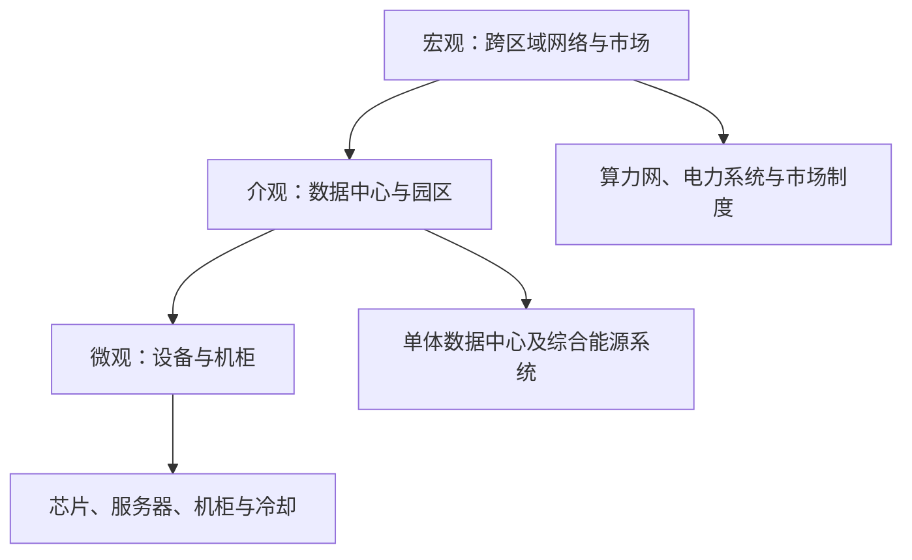

# 研究对象地图

## 三个尺度

三个尺度不是互斥分类。宏观调度最终要落到介观数据中心的容量，再落实为微观设备的负载、功率和温度；微观实测数据又会反过来决定介观模型与宏观交易是否可信。

## 微观：设备与机柜

| 研究对象 | 主要观察变量 | 核心问题 |
| --- | --- | --- |
| [[芯片（CPU-GPU）]] | 频率、电压、利用率、功率、温度 | 计算负荷怎样变成功耗和发热 |
| [[服务器]] | 吞吐量、算力、负载率、功率 | 哪个负载率下算效最高 |
| [[内存-存储-网络]] | 读写率、占用率、I/O功率 | 非GPU功耗怎样计入 |
| [[机柜]] | 总功率、功率密度、层间温差 | 高密计算怎样安全散热 |
| [[冷板及液冷回路]] | 流量、入口温度、压降、换热量 | 冷却怎样跟随动态计算负荷 |
| [[供配电设备]] | 转换效率、损耗 | IT设备之外损失多少电 |

## 介观：数据中心与园区

| 研究对象 | 主要组成 | 核心问题 |
| --- | --- | --- |
| [[数据中心]] | IT、供配电、制冷、备用电源 | 总能耗怎样形成 |
| [[算力综合能源系统]] | 算力、电力、冷力、热力、储能 | 多种能源怎样联合优化 |
| [[可再生能源供能系统]] | 光伏、风电、公共电网 | 波动绿电怎样匹配算力负荷 |
| [[储能系统]] | 电池、氢储能、蓄冷 | 怎样平衡不同时间尺度的波动 |
| [[余热利用系统]] | 热泵、换热器、吸收式制冷 | 低品位余热能否形成收益 |
| [[园区运营主体]] | 数据中心、电网、热用户、能源商 | 成本、风险和收益怎样分配 |

## 宏观：跨区域网络与市场

| 研究对象 | 主要组成 | 核心问题 |
| --- | --- | --- |
| [[多数据中心集群]] | 不同地区的算力设施 | 任务应在哪里执行 |
| [[全国一体化算力网]] | 算、存、运、网络 | 算力如何跨区域调度 |
| [[电力系统]] | 电源、电网、负荷、储能 | 算力负荷如何与电网互动 |
| [[算力市场]] | 供应商、平台、用户 | 算力如何描述、交易和结算 |
| [[电力与碳市场]] | 电价、绿电、绿证、碳价 | 外部价格如何影响任务调度 |
| [[政府与标准机构]] | 政策、术语、评价、监管 | 如何建立共同口径 |

## 跨尺度接口

1. **任务接口**：[[任务画像]]把业务需求传到服务器和数据中心。
2. **能量接口**：[[IT功率]]、[[热负荷]]和[[PUE]]把设备状态汇总为设施电量。
3. **环境接口**：[[电网排放因子]]和绿电属性把设施电量转成碳结果。
4. **经济接口**：[[TCO]]把技术效果转成投资与运行判断。
5. **制度接口**：[[计量]]、[[评价体系]]、[[标准体系]]和[[交易结算]]让多主体使用同一结果。

## 边界提醒

- 微观最适合研究机理和实测，但不能单独证明跨区域调度的经济性。
- 介观最适合研究联合运行，但结果高度依赖设备参数和当地能源条件。
- 宏观最适合研究配置与市场，但聚合模型可能掩盖设备、业务和地区差异。
