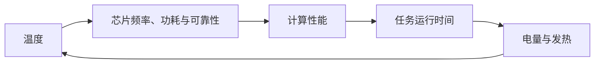

# 三个反馈回路

## 一、算力—功率—温度反馈

这条回路说明[[IT功率]]到[[热负荷]]不是单向换算。温度变化会反过来影响芯片泄漏功耗、降频、性能和可靠性，运行时间又改变总电量。因此，[[温度柔性]]的收益必须同时计算冷却节电和服务器侧代价。

## 二、价格—调度—系统状态反馈

这条回路说明外部价格和碳信号不是静态背景。大规模[[时序迁移]]和[[空间迁移]]会改变负荷与边际机组，进而改变后续价格和[[边际排放因子]]。只用固定价格和固定碳强度计算大规模调度，可能高估收益。

## 三、标准—投资—数据反馈

这条回路说明[[标准体系]]并非经济发展后的静态终点。标准影响设备选择、计量投入和商业模式，实际项目产生的新数据又会修正标准、评价和[[交易结算]]。研究建议、试点经验与已发布标准必须分别记录。

## 使用方式

每次建立优化模型或商业判断，至少检查是否遗漏其中一个反向作用。若只写单向收益而不检查反馈，结论应标为初步情景而非稳定规律。
